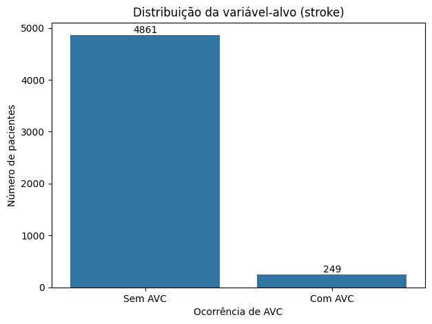

# Projeto de Machine Learning

## Informações gerais

**Docente:**  
- Humberto Sandman

**Integrantes:**  
- Emily Britto [emilybg@al.insper.edu.br]

- Gabriel Aguiar [gabrielca5@al.insper.edu.br]

**Data da entrega:** 14/09/2026

**Dataset escolhido:** Stroke Prediction Dataset

**Tipo de problema:** Classificação

---

## Objetivo

Esta APS tem como objetivo desenvolver uma EDA (análise exploratória de dados) do Stroke Prediction Dataset a fim de entender a estrutura, qualidade, distribuições, relações entre variáveis (numéricas e categóricas) e desafios, como missing values e vieses, preparando para a modelagem nas fases subsequentes.

Para isso, as manipulações e testes realizados foram feitos em um notebook do Google Colab (cujo link será referenciado ainda nessa seção), e, para melhor explicação das tarefas, produzimos este material complementar (e isso foi 100% por iniciativa própria e com certeza não foi porque era um requisito pra tirar ´+´... rs)

[Notebook no Google Colab](https://colab.research.google.com/drive/1MHs2PKBQe6oGy44FMrf2f06dGMeOZdlX?usp=sharing)

[Repositório no GitHub](https://github.com/emilybrtt/projeto-machine-learning)

---

# 1. Carregamento e inspeção inicial dos dados:
    - Explicar cada feature do dataset.
    - Verificar o número de instâncias e features.
    - Identificar tipos de dados (numéricos, categóricos).
    - Detectar valores ausentes e inconsistências.
    - Verificar se há desbalanceamento de classes.
    - Realizar a separação dos dados em conjuntos de treino e teste, quando necessário.

## 1.1 Sobre o dataset

O dataset utilizado neste projeto foi obtido no Kaggle. Ele contém informações sobre pacientes e é usado para prever se um paciente é mais sucetível a ter um AVC (Acidente Vascular Cerebral) com base em características como gênero, idade, doenças cardíacas pré-existentes, etc.

- **Fonte:** [Kaggle](https://www.kaggle.com/datasets/fedesoriano/stroke-prediction-dataset)
- **Número de linhas:** 5110
- **Número de features (colunas):** 12
- **Variável-alvo:** `stroke`
- **Tipo de problema:** Classificação

## 1.2 Sobre as features do dataset

| Feature | Tipo | Descrição |
|---|---|---|
| `id` | Identificador | Identificador único do paciente |
| `gender` | Categórica nominal | Gênero do paciente (`Male`, `Female` ou `Other`) |
| `age` | Numérica contínua | Idade do paciente |
| `hypertension` | Categórica binária | Indica presença de hipertensão: `1` para sim e `0` para não |
| `heart_disease` | Categórica binária | Indica presença de doença cardíaca: `1` para sim e `0` para não |
| `ever_married` | Categórica binária | Indica se o paciente já foi casado (`Yes` ou `No`) |
| `work_type` | Categórica nominal | Tipo de ocupação (`children`, `Govt_job`, `Never_worked`, `Private` ou `Self-employed`) |
| `Residence_type` | Categórica binária | Tipo de área de residência (`Rural` ou `Urban`) |
| `avg_glucose_level` | Numérica contínua | Nível médio de glicose no sangue |
| `bmi` | Numérica contínua | Índice de Massa Corporal (IMC) do paciente |
| `smoking_status` | Categórica nominal | Situação em relação ao tabagismo (`formerly smoked`, `never smoked`, `smokes` ou `Unknown`) |
| `stroke` | Target binário | Indica ocorrência de AVC: `1` para sim e `0` para não |

## 1.3 Tipos das variáveis
### Variáveis numéricas

- `age`
- `avg_glucose_level`
- `bmi`

Ou seja, são 3 variáveis numéricas. 

!!! note "Sobre a variável `id`"
    Embora `id` seja armazenada numericamente no dataset, ela não representa uma grandeza quantitativa, mas apenas um identificador único de cada paciente. Por esse motivo, ela não será considerada uma feature numérica nas análises estatísticas nem utilizada posteriormente como variável preditora.

### Variáveis categóricas

- `gender`
- `hypertension`
- `heart_disease`
- `ever_married`
- `work_type`
- `Residence_type`
- `smoking_status`

Já aqui, são 7 variáveis categóricas.

!!! note "Sobre a variável `stroke`"
    A variável `stroke` também é categórica binária, porém é tratada separadamente por ser a variável-alvo do problema.

### Observações

De início, já percebemos que existem bem mais variáveis categóricas e que elas exigirão diferentes manipulações, que traremos mais à frente.

## 1.4 Valores ausentes e inconsistências

A inspeção inicial revelou dois tipos diferentes de ausência de informação no dataset: valores ausentes explícitos e valores ausentes representados por uma categoria textual.

### Valores ausentes explícitos

A análise utilizando os valores nulos reconhecidos pelo Pandas identificou ausência apenas na variável `bmi`.

| Feature | Valores ausentes | Percentual |
|---|---:|---:|
| `bmi` | 201 | 3,93% |

Portanto, aproximadamente 3,93% dos pacientes não possuem informação registrada para o Índice de Massa Corporal.

A estratégia utilizada para tratar esses valores será definida mais a frente, no pré-processamento.

### Ausência de informação em `smoking_status`

Além dos valores `NaN`, foi identificada uma situação particular na variável `smoking_status`:

Segundo a [documentação](https://www.kaggle.com/datasets/fedesoriano/stroke-prediction-dataset/data) do dataset, a categoria `Unknown` significa que a informação sobre o status de tabagismo não está disponível para aquele paciente.

Foram encontrados:

| Situação | Quantidade | Percentual |
|---|---:|---:|
| `smoking_status = "Unknown"` | 1.544 | 30,22% |

Assim, apesar de `Unknown` não ser reconhecido como um valor nulo, ele representa ausência de informação.

~30% dos pacientes tem `smoking_status` desconhecido. Substituir esses registros pela categoria mais frequente, por exemplo, seria atribuir um comportamento de tabagismo a uma parcela relativamente grande dos pacientes. Assim, nessa etapa optamos por preservar `Unknown`, em vez de realizar uma imputação.

---

## 1.5 Verificação de inconsistências
### Registros duplicados

Não foram identificadas linhas completamente duplicadas no dataset. Também foi verificada a coluna `id`, utilizada como identificador dos pacientes, para detectar possíveis identificadores repetidos.

### Categorias das variáveis

Os valores únicos das variáveis categóricas foram inspecionados individualmente para identificar problemas de capitalização, erros de escrita ou categorias inesperadas.

As categorias encontradas são consistentes com a documentação do dataset.

Um caso que merece atenção é a categoria `Other` da variável `gender`, que apresenta frequência muito baixa. Apesar disso, ela não foi considerada uma inconsistência, pois é prevista na descrição do dataset.

### Variáveis numéricas

As variáveis `age`, `avg_glucose_level` e `bmi` também foram inspecionadas por meio de estatísticas descritivas para identificar valores potencialmente impossíveis ou suspeitos.

Neste momento, valores extremos não foram automaticamente classificados como erros nem removidos. A existência e o impacto de possíveis *outliers* serão investigados em maior profundidade durante a análise univariada.

## 1.6 Distribuição da variável-alvo

A variável-alvo deste projeto é `[nome do target]`.

### Interpretação

[Explique o que o gráfico mostra.]

[Para classificação: informe se as classes estão balanceadas ou desbalanceadas.]

[Para regressão: descreva a distribuição, assimetria, amplitude e possíveis valores extremos.]

---

## 1.7 Separação entre treino e teste

---

# 2. Análise univariada:

    - Calcular estatísticas descritivas (média, mediana, desvio padrão) de todas as variáveis numéricas.
    - Criar histogramas, boxplots e/ou violinos para variáveis numéricas (máximo 3).
    - Para variáveis categóricas: calcular frequências e criar gráficos de barras (máximo 3).

## 2.1 Análise univariada

A análise univariada foi utilizada para compreender individualmente a distribuição e as características de cada variável.

### Estatísticas descritivas

| Variável | Média | Mediana | Desvio padrão | Mínimo | Máximo |
|---|---:|---:|---:|---:|---:|
| `[variável_1]` | [valor] | [valor] | [valor] | [valor] | [valor] |
| `[variável_2]` | [valor] | [valor] | [valor] | [valor] | [valor] |
| `[variável_3]` | [valor] | [valor] | [valor] | [valor] | [valor] |

### Variável `[nome da variável]`

**Interpretação:**  
[Explique a distribuição, concentração dos valores, assimetria e presença de possíveis outliers.]

### Variável `[nome da variável]`

**Interpretação:**  
[Explique os principais resultados observados.]

### Variável categórica `[nome da variável]`

**Interpretação:**  
[Explique quais categorias são mais frequentes e se existe algum desequilíbrio relevante.]

---

# 4. Pré-processamento para modelagem:

    - Escolher e justificar estratégia para lidar com valores ausentes (remoção, imputação).
    - Escolher e justificar estratégia para lidar com outliers (remoção, transformação).
    - Escolher e justificar estratégia para encoding de variáveis categóricas (one-hot encoding, label encoding).
    - Escolher e justificar estratégia para normalização ou padronização de variáveis numéricas (Min-Max Scaling, Standardization, etc.).
    - Nas variáveis numéricas, aplicar uma técnica de redução de dimensionalidade, como PCA, para visualizar a estrutura dos dados e identificar possíveis agrupamentos ou padrões.
    - Analisar os resultados da redução de dimensionalidade para obter insights sobre a separabilidade das classes e a importância das features.
    - Construir um pipeline de pré-processamento (utilizando Pipeline e ColumnTransformer do sklearn) que inclua as etapas acima, garantindo que seja aplicável para as fases de modelagem subsequentes.

# 5. Documentação e apresentação:

    - Todos os requisitos do projeto explicitados em cada ponto acima, assim como todas as figuras produzidas e decisões tomadas, devem ser justificados de maneira objetiva.
    - As visualizações produzidas devem ser claras e informativas com títulos, rótulos e legendas adequados.
    - Preparar um relatório que resuma os principais achados e as estratégias propostas para a modelagem.
    - O código deve ser bem organizado, com comentários explicativos para cada etapa.
    - O grupo deve justificar todas as escolhas de pré-processamento com base nos achados da EDA, garantindo que as estratégias propostas sejam adequadas para os desafios identificados no dataset.
    - Python obrigatório, utilizando as bibliotecas  Pandas, NumPy, Matplotlib, Seaborn e Scikit-learn.
