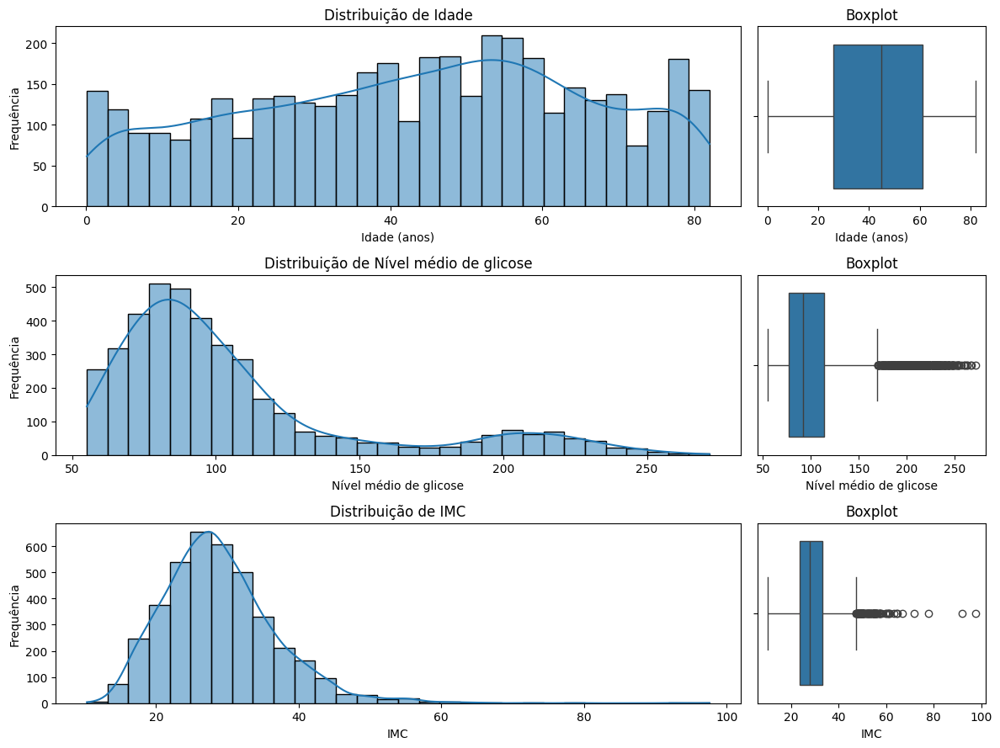
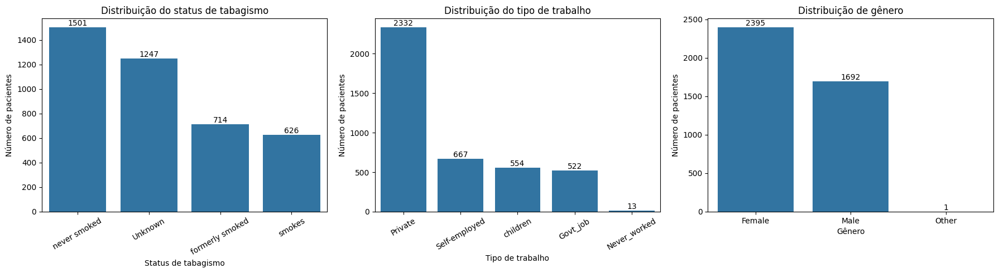

# Projeto de Machine Learning

## Informações gerais

**Docente:** Humberto Sandman

**Integrantes:**  

- Emily Britto -- emilybg@al.insper.edu.br

- Gabriel Aguiar -- gabrielca5@al.insper.edu.br

**Data da entrega:** 14/09/2026

**Dataset escolhido:** Stroke Prediction Dataset

**Tipo de problema:** Classificação

---

## Objetivo

Esta APS tem como objetivo desenvolver uma EDA (análise exploratória de dados) do Stroke Prediction Dataset a fim de entender a estrutura, qualidade, distribuições, relações entre variáveis (numéricas e categóricas) e desafios, como missing values e vieses, preparando para a modelagem nas fases subsequentes.

Para isso, as manipulações e testes realizados foram feitos em um notebook do Google Colab (cujo link será referenciado ainda nessa seção), e, para melhor explicação das tarefas, produzimos este material complementar (e isso foi 100% por iniciativa própria e com certeza não foi porque era um requisito pra tirar ´+´... rs)

[Notebook no Google Colab](https://colab.research.google.com/drive/1MHs2PKBQe6oGy44FMrf2f06dGMeOZdlX?usp=sharing)

[Repositório no GitHub](https://github.com/emilybrtt/projeto-machine-learning)

---

# 1. Carregamento e inspeção inicial dos dados:
    - Explicar cada feature do dataset.
    - Verificar o número de instâncias e features.
    - Identificar tipos de dados (numéricos, categóricos).
    - Detectar valores ausentes e inconsistências.
    - Verificar se há desbalanceamento de classes.
    - Realizar a separação dos dados em conjuntos de treino e teste, quando necessário.

## 1.1 Sobre o dataset

O dataset utilizado neste projeto foi obtido no Kaggle. Ele contém informações sobre pacientes e é usado para prever se um paciente é mais sucetível a ter um AVC (Acidente Vascular Cerebral) com base em características como gênero, idade, doenças cardíacas pré-existentes, etc.

- **Fonte:** [Kaggle](https://www.kaggle.com/datasets/fedesoriano/stroke-prediction-dataset)
- **Número de linhas:** 5110
- **Número de features (colunas):** 12
- **Variável-alvo:** `stroke`
- **Tipo de problema:** Classificação

## 1.2 Sobre as features do dataset

| Feature | Tipo | Descrição |
|---|---|---|
| `id` | Identificador | Identificador único do paciente |
| `gender` | Categórica nominal | Gênero do paciente (`Male`, `Female` ou `Other`) |
| `age` | Numérica contínua | Idade do paciente |
| `hypertension` | Categórica binária | Indica presença de hipertensão: `1` para sim e `0` para não |
| `heart_disease` | Categórica binária | Indica presença de doença cardíaca: `1` para sim e `0` para não |
| `ever_married` | Categórica binária | Indica se o paciente já foi casado (`Yes` ou `No`) |
| `work_type` | Categórica nominal | Tipo de ocupação (`children`, `Govt_job`, `Never_worked`, `Private` ou `Self-employed`) |
| `Residence_type` | Categórica binária | Tipo de área de residência (`Rural` ou `Urban`) |
| `avg_glucose_level` | Numérica contínua | Nível médio de glicose no sangue |
| `bmi` | Numérica contínua | Índice de Massa Corporal (IMC) do paciente |
| `smoking_status` | Categórica nominal | Situação em relação ao tabagismo (`formerly smoked`, `never smoked`, `smokes` ou `Unknown`) |
| `stroke` | Target binário | Indica ocorrência de AVC: `1` para sim e `0` para não |

## 1.3 Tipos das variáveis
### Variáveis numéricas

- `age`
- `avg_glucose_level`
- `bmi`

Ou seja, são 3 variáveis numéricas. 

!!! note "Sobre a variável `id`"
    Embora `id` seja armazenada numericamente no dataset, ela não representa uma grandeza quantitativa, mas apenas um identificador único de cada paciente. Por esse motivo, ela não será considerada uma feature numérica nas análises estatísticas nem utilizada posteriormente como variável preditora.

### Variáveis categóricas

- `gender`
- `hypertension`
- `heart_disease`
- `ever_married`
- `work_type`
- `Residence_type`
- `smoking_status`

Já aqui, são 7 variáveis categóricas.

!!! note "Sobre a variável `stroke`"
    A variável `stroke` também é categórica binária, porém é tratada separadamente por ser a variável-alvo do problema.

### Observações

De início, já percebemos que existem bem mais variáveis categóricas e que elas exigirão diferentes manipulações, que traremos mais à frente.

## 1.4 Valores ausentes e inconsistências

A inspeção inicial revelou dois tipos diferentes de ausência de informação no dataset: valores ausentes explícitos e valores ausentes representados por uma categoria textual.

### Valores ausentes explícitos

A análise utilizando os valores nulos reconhecidos pelo Pandas identificou ausência apenas na variável `bmi`.

| Feature | Valores ausentes | Percentual |
|---|---:|---:|
| `bmi` | 201 | 3,93% |

Portanto, aproximadamente 3,93% dos pacientes não possuem informação registrada para o Índice de Massa Corporal.

A estratégia utilizada para tratar esses valores será definida mais a frente, no pré-processamento.

### Ausência de informação em `smoking_status`

Além dos valores `NaN`, foi identificada uma situação particular na variável `smoking_status`:

Segundo a [documentação](https://www.kaggle.com/datasets/fedesoriano/stroke-prediction-dataset/data) do dataset, a categoria `Unknown` significa que a informação sobre o status de tabagismo não está disponível para aquele paciente.

Foram encontrados:

| Situação | Quantidade | Percentual |
|---|---:|---:|
| `smoking_status = "Unknown"` | 1.544 | 30,22% |

Assim, apesar de `Unknown` não ser reconhecido como um valor nulo, ele representa ausência de informação.

~30% dos pacientes tem `smoking_status` desconhecido. Substituir esses registros pela categoria mais frequente, por exemplo, seria atribuir um comportamento de tabagismo a uma parcela relativamente grande dos pacientes. Assim, nessa etapa optamos por preservar `Unknown`, em vez de realizar uma imputação.

---

## 1.5 Verificação de inconsistências
### Registros duplicados

Não foram identificadas linhas completamente duplicadas no dataset. Também foi verificada a coluna `id`, utilizada como identificador dos pacientes, para detectar possíveis identificadores repetidos.

### Categorias das variáveis

Os valores únicos das variáveis categóricas foram inspecionados individualmente para identificar problemas de capitalização, erros de escrita ou categorias inesperadas.

As categorias encontradas são consistentes com a documentação do dataset.

Um caso que merece atenção é a categoria `Other` da variável `gender`, que apresenta frequência muito baixa. Apesar disso, ela não foi considerada uma inconsistência, pois é prevista na descrição do dataset.

### Variáveis numéricas

As variáveis `age`, `avg_glucose_level` e `bmi` também foram inspecionadas por meio de estatísticas descritivas para identificar valores potencialmente impossíveis ou suspeitos.

Neste momento, valores extremos não foram automaticamente classificados como erros nem removidos. A existência e o impacto de possíveis *outliers* serão investigados em maior profundidade durante a análise univariada.

## 1.6 Distribuição da variável-alvo

## 1.6 Distribuição da variável-alvo

A variável-alvo deste projeto é `stroke`, uma variável binária que indica
se o paciente teve (`1`) ou não teve (`0`) um AVC.

A análise de sua distribuição revelou uma diferença expressiva entre as
duas classes.

| Classe | Quantidade | Percentual |
|---|---:|---:|
| Sem AVC (`0`) | 4.861 | 95,13% |
| Com AVC (`1`) | 249 | 4,87% |

### Interpretação

A variável-alvo apresenta forte desbalanceamento de classes. Aproximadamente
95% dos pacientes pertencem à classe sem ocorrência de AVC, enquanto menos
de 5% pertencem à com ocorrência.

Esse desbalanceamento é relevante tanto para a separação dos dados quanto para
a futura avaliação dos modelos. Uma divisão aleatória que não preserve a proporção
das classes poderia gerar conjuntos de treino e teste pouco representativos.

Por esse motivo, a separação dos dados será realizada utilizando [estratificação pela variável-alvo](https://datasciencediagnostics.com/diagnostics/procedure/background/stratify-label/).

O desbalanceamento também deverá ser considerado na etapa de modelagem, uma
vez que a acurácia isoladamente pode fornecer uma visão inadequada do desempenho
do classificador. Um modelo que privilegie excessivamente a classe majoritária
poderia apresentar alta acurácia mesmo com baixa capacidade de identificar
pacientes pertencentes à classe minoritária.

---

## 1.7 Separação entre treino e teste

Após a inspeção inicial dos dados, o dataset foi separado em conjuntos de
treino e teste.

Foram utilizadas as seguintes proporções:

- **Treino:** 80%
- **Teste:** 20%
- **Random state:** `42`
- **Estratificação:** variável-alvo `stroke`

Antes da separação, a coluna `id` foi removida das features. 

A variável-alvo foi separada das demais features da seguinte forma:

- `X`: características utilizadas como entrada;
- `y`: variável-alvo `stroke`.

Como foi identificado um forte desbalanceamento entre as classes, utilizamos `stratify=y` durante a divisão. Dessa forma, as proporções de pacientes com e sem AVC são preservadas aproximadamente nos conjuntos de treino e teste.

| Classe | Dataset completo | Treino | Teste |
|---|---:|---:|---:|
| Sem AVC (`0`) | 95.13% | 95.13% | 95.11% |
| Com AVC (`1`) | 4.87% | 4.87% | 4.89% |

A separação foi realizada antes das etapas de pré-processamento que aprendem parâmetros a partir dos dados, como imputação e padronização. Essas transformações serão ajustadas exclusivamente sobre o conjunto de treino e posteriormente aplicadas ao conjunto de teste, reduzindo o risco de *data leakage*.

A partir deste ponto, as análises exploratórias mais aprofundadas serão realizadas sobre o **conjunto de treino**. O conjunto de teste permanecerá reservado para a avaliação das etapas posteriores do projeto.

# 2. Análise univariada:

    - Calcular estatísticas descritivas (média, mediana, desvio padrão) de todas as variáveis numéricas.
    - Criar histogramas, boxplots e/ou violinos para variáveis numéricas (máximo 3).
    - Para variáveis categóricas: calcular frequências e criar gráficos de barras (máximo 3).

## 2.1 Análise univariada

Após a separação dos dados, realizamos a análise univariada utilizando o
conjunto de treino.

O objetivo desta etapa é compreender individualmente a distribuição de cada
variável, observando medidas de tendência central e dispersão, assimetrias,
categorias predominantes, valores ausentes e possíveis valores extremos.

As variáveis numéricas analisadas foram:

- `age`;
- `avg_glucose_level`;
- `bmi`.

Para as variáveis categóricas, foram selecionadas três features para
visualização, respeitando o limite estabelecido na proposta:

- `smoking_status`;
- `work_type`;
- `gender`.

As demais variáveis categóricas continuam sendo consideradas no projeto e
serão especialmente relevantes nas análises de associação com a variável-alvo.

## 2.1 Estatísticas descritivas das variáveis numéricas

As principais estatísticas descritivas das variáveis numéricas no conjunto
de treino são apresentadas abaixo.

| Variável | Média | Mediana | Desvio padrão | Mínimo | Máximo |
|---|---:|---:|---:|---:|---:|
| `age` | 43,35 | 45,00 | 22,60 | 0,08 | 82,00 |
| `avg_glucose_level` | 106,32 | 91,94 | 45,26 | 55,12 | 271,74 |
| `bmi` | 28,92 | 28,00 | 7,93 | 10,30 | 97,60 |

As estatísticas já sugerem comportamentos distintos entre as três variáveis.

Em `age`, média e mediana apresentam valores próximos. Em
`avg_glucose_level`, entretanto, a média é consideravelmente superior à
mediana, indicando possível assimetria à direita. `bmi` também apresenta
valor máximo bastante distante de sua média e mediana.

Esses padrões são investigados visualmente nas seções seguintes.

## 2.2 Distribuição das variáveis numéricas

Para complementar as estatísticas descritivas, foram utilizados histogramas
e boxplots para analisar a forma das distribuições e identificar possíveis
valores extremos.

### Idade

A variável `age` apresenta ampla dispersão, variando de 0,08 a 82 anos,
com média de 43,35 e mediana de 45 anos.

A proximidade entre média e mediana não indica assimetria acentuada, e o
boxplot não identifica observações como outliers pelo critério padrão do
intervalo interquartil.

Embora existam idades muito baixas, elas não foram classificadas
automaticamente como inconsistências, uma vez que o dataset contém pacientes
de diferentes faixas etárias.

### Nível médio de glicose

A variável `avg_glucose_level` apresenta clara assimetria à direita. A maior
parte das observações está concentrada em valores mais baixos, enquanto existe
uma cauda que se estende até valores superiores a 250.

Esse comportamento também é refletido pela diferença entre a média (106,32)
e a mediana (91,94).

O boxplot identifica diversos valores elevados como potenciais outliers.
Entretanto, sua classificação estatística como valores extremos não significa
necessariamente que sejam erros, motivo pelo qual essas observações foram
investigadas posteriormente antes de qualquer decisão de tratamento.

### IMC

A variável `bmi` apresenta maior concentração aproximadamente na região
entre 20 e 35, com média de 28,92 e mediana de 28,00.

Apesar da proximidade entre essas medidas, observa-se uma cauda à direita e
diversos valores elevados classificados como potenciais outliers pelo boxplot.
O maior IMC observado no conjunto de treino é 97,60.

Além disso, `bmi` possui valores ausentes, que permanecem sem imputação nesta
etapa da análise exploratória. A estratégia para tratá-los será definida na
etapa de pré-processamento.

## 2.3 Investigação dos potenciais outliers

Para complementar a inspeção visual, utilizamos o critério de 1,5 vezes o
intervalo interquartil (IQR) para quantificar observações estatisticamente
extremas.

| Variável | Limite inferior | Limite superior | Outliers | Percentual |
|---|---:|---:|---:|---:|
| `age` | -26,50 | 113,50 | 0 | 0,00% |
| `avg_glucose_level` | 21,98 | 169,52 | 503 | 12,30% |
| `bmi` | 9,35 | 47,35 | 90 | 2,30% |

O critério não identificou outliers em `age`. Em contrapartida,
`avg_glucose_level` apresentou 503 observações classificadas como extremas,
correspondentes a 12,3% dos valores, enquanto `bmi` apresentou 90
observações, ou 2,3%.

Como a identificação estatística de um outlier não implica necessariamente
erro de medição ou registro, optamos por investigar essas observações antes
de decidir por sua remoção.

A decisão sobre o tratamento dessas observações não foi tomada apenas a
partir do critério do IQR. Como valores extremos podem representar
observações legítimas e potencialmente informativas, sua relação com a
variável-alvo será investigada na análise bivariada antes da definição da
estratégia final de pré-processamento.

## 2.4 Análise das variáveis categóricas

Para a análise univariada das variáveis categóricas, foram selecionadas
`smoking_status`, `work_type` e `gender`, respeitando o limite de três
visualizações estabelecido na proposta.

### Frequências

#### Status de tabagismo

| Categoria | Quantidade | Percentual |
|---|---:|---:|
| `never smoked` | 1.501 | 36,72% |
| `Unknown` | 1.247 | 30,50% |
| `formerly smoked` | 714 | 17,47% |
| `smokes` | 626 | 15,31% |

#### Tipo de trabalho

| Categoria | Quantidade | Percentual |
|---|---:|---:|
| `Private` | 2.332 | 57,05% |
| `Self-employed` | 667 | 16,32% |
| `children` | 554 | 13,55% |
| `Govt_job` | 522 | 12,77% |
| `Never_worked` | 13 | 0,32% |

#### Gênero

| Categoria | Quantidade | Percentual |
|---|---:|---:|
| `Female` | 2.395 | 58,59% |
| `Male` | 1.692 | 41,39% |
| `Other` | 1 | 0,02% |

### Visualização

### Interpretação

A variável `smoking_status` apresenta `never smoked` como categoria mais
frequente (36,72%). Entretanto, destaca-se a elevada frequência da categoria
`Unknown`, correspondente a 30,50% dos pacientes do conjunto de treino.
Segundo a documentação do dataset, essa categoria representa indisponibilidade
da informação sobre tabagismo e, portanto, pode ser interpretada como uma
ausência semântica.

A elevada proporção de valores `Unknown` reforça a decisão de não realizar
imputação pela moda. Caso esses registros fossem substituídos por
`never smoked`, por exemplo, estaríamos atribuindo artificialmente um
comportamento de tabagismo a uma parcela significativa dos pacientes.
Por esse motivo, `Unknown` será preservado como uma categoria explícita
durante o encoding.

Em `work_type`, observa-se predominância da categoria `Private`, que representa
57,05% das observações. Em contraste, `Never_worked` contém apenas 13 pacientes
(0,32%), sendo uma categoria bastante rara. Ela será preservada, mas sua baixa
frequência deve ser considerada ao interpretar análises envolvendo essa categoria.

Por fim, `gender` apresenta maior frequência de pacientes classificados como
`Female` (58,59%), seguidos por `Male` (41,39%). A categoria `Other` aparece em
apenas uma observação do conjunto de treino (0,02%). Como essa categoria está
prevista na documentação original do dataset, ela não foi considerada uma
inconsistência, embora sua frequência seja insuficiente para sustentar conclusões
estatísticas específicas sobre esse grupo.

## 2.5 Visualização das variáveis categóricas

As frequências das três variáveis categóricas selecionadas também foram
representadas graficamente.

Os gráficos evidenciam visualmente alguns dos principais desequilíbrios
identificados nas tabelas de frequência, especialmente a elevada presença
de `Unknown` em `smoking_status`, a predominância de `Private` em
`work_type` e a ocorrência extremamente rara da categoria `Other` em
`gender`.

# 4. Pré-processamento para modelagem:

    - Escolher e justificar estratégia para lidar com valores ausentes (remoção, imputação).
    - Escolher e justificar estratégia para lidar com outliers (remoção, transformação).
    - Escolher e justificar estratégia para encoding de variáveis categóricas (one-hot encoding, label encoding).
    - Escolher e justificar estratégia para normalização ou padronização de variáveis numéricas (Min-Max Scaling, Standardization, etc.).
    - Nas variáveis numéricas, aplicar uma técnica de redução de dimensionalidade, como PCA, para visualizar a estrutura dos dados e identificar possíveis agrupamentos ou padrões.
    - Analisar os resultados da redução de dimensionalidade para obter insights sobre a separabilidade das classes e a importância das features.
    - Construir um pipeline de pré-processamento (utilizando Pipeline e ColumnTransformer do sklearn) que inclua as etapas acima, garantindo que seja aplicável para as fases de modelagem subsequentes.

# 5. Documentação e apresentação:

    - Todos os requisitos do projeto explicitados em cada ponto acima, assim como todas as figuras produzidas e decisões tomadas, devem ser justificados de maneira objetiva.
    - As visualizações produzidas devem ser claras e informativas com títulos, rótulos e legendas adequados.
    - Preparar um relatório que resuma os principais achados e as estratégias propostas para a modelagem.
    - O código deve ser bem organizado, com comentários explicativos para cada etapa.
    - O grupo deve justificar todas as escolhas de pré-processamento com base nos achados da EDA, garantindo que as estratégias propostas sejam adequadas para os desafios identificados no dataset.
    - Python obrigatório, utilizando as bibliotecas  Pandas, NumPy, Matplotlib, Seaborn e Scikit-learn.
